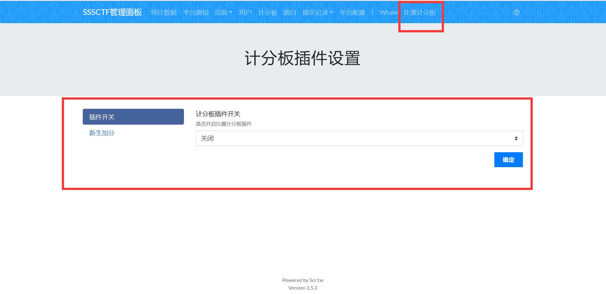
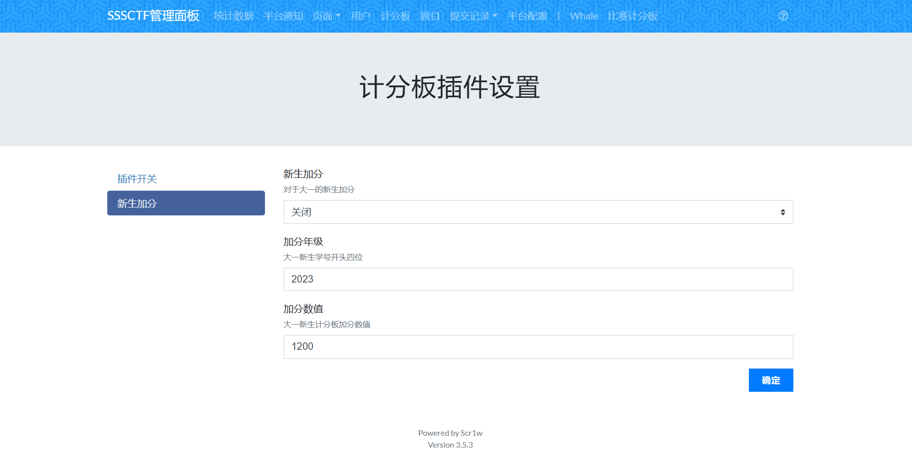

# ctfd-matrix-scoreboard

学长原始仓库地址 https://github.com/Ephemeral1y/ctfd-matrix-scoreboard

## Usage

在`CTFd`的`CTFd/plugins`目录下

```bash
git clone https://github.com/IShiraiKurokoI/CTFd-Matrix-Scoreboard /matrix
docker restart ctfd_ctfd_1
```

一些参数的修改





计分板现已支持全部任意类别题目
